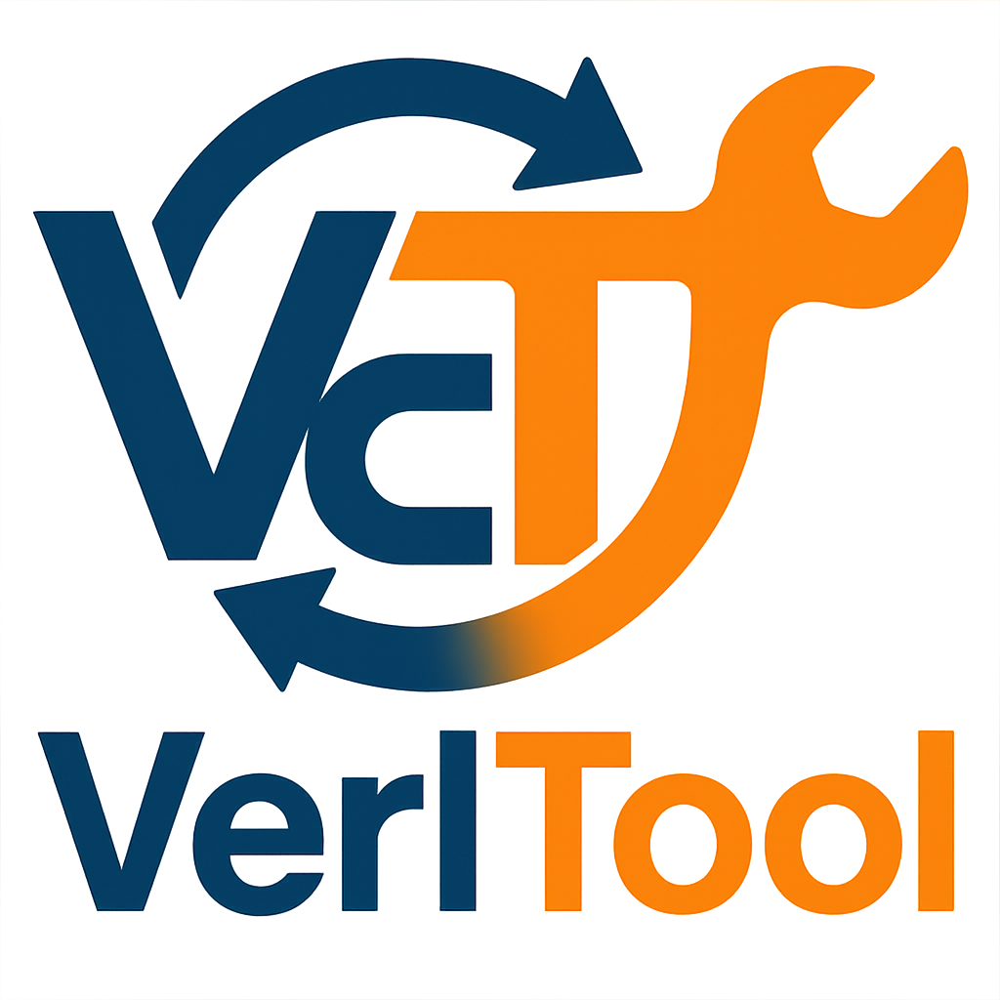

# Verl-Tool: Multimodal Deep Research

<p align="center">
  <picture>
    <source media="(prefers-color-scheme: dark)" srcset="assets/imgs/logo.png">
    
  </picture>
</p>

<h3 align="center">
VerlTool: Multimodal Deep Research Training Framework
</h3>

---

## Overview

VerlTool provides a unified framework for training multimodal agents capable of deep research tasks. This framework extends verl to support multimodal tool-calling agents that can interact with web search, image search, and content extraction tools to perform comprehensive research tasks.

## Setup

### Prerequisites
The following versions are required:
- vllm: 0.11.0
- verl: 0.7.0.dev0
- torch: 2.8.0
- transformers: 4.57.3
- qwen-omni-utils: 0.0.8
- qwen-vl-utils: 0.0.14
- ray: 2.52.1
- openai: 2.9.0
- flash-attn: 2.8.3

### Conda Installation (Recommended)
We recommend using conda to install verl-tool.

```bash
git submodule update --init --recursive
conda create --name verl-tool-env python=3.10
conda activate verl-tool-env
pip install -e verl
pip install -e ".[vllm,acecoder,torl,search_tool]"
pip install "flash-attn==2.8.3" --no-build-isolation
```

### Alternative: UV Installation
```bash
# install uv if not installed first
git submodule update --init --recursive
uv sync
source .venv/bin/activate
uv pip install -e verl
uv pip install -e ".[vllm,acecoder,torl,search_tool]"
uv pip install "flash-attn==2.8.3" --no-build-isolation
```

### Installation of Megatron (Optional)
For using megatron as the distributed training backend:
```bash
pip install megatron-core
pip install --no-build-isolation transformer-engine[pytorch]
```

## Training

### Setup WandB

Before training, set up WandB for experiment tracking:

```bash
# Set your WandB API key
export WANDB_API_KEY=<YOUR_WANDB_API_KEY>

# Optionally set WandB entity (your team/username)
export WANDB_ENTITY=<YOUR_WANDB_ENTITY>

# Or login to WandB
wandb login
```

### Launch Training

To launch multimodal deep research model training:

```bash
conda activate $env
bash examples/train/mm_deep_research/train/train_multimodal_8b_qwen3vl.sh
```

## Features

- 🔧 **Complete decoupling of actor rollout and environment interaction** - We use verl as a submodule to benefit from ongoing verl repository updates. All tool calling is integrated via a unified API, allowing you to easily add new tools by simply adding a Python file and testing independently.
- 🌍 **Tool-as-environment paradigm** - Each tool interaction can modify the environment state. We store and reload environment states for each trajectory.
- ⚡ **Native RL framework for tool-calling agents** - verl-tool natively supports multi-turn interactive loops between agents and their tool environments.
- 🖼️ **Multimodal support** - Native support for multimodal agent loops with image understanding, image search, and multimodal reasoning capabilities.
- 📊 **User-friendly evaluation suite** - Launch your trained model with OpenAI API alongside the tool server. Simply send questions and get final outputs with all interactions handled internally.


## 📚 Documentation
- 📖 [Installation Guide](./assets/docs/install.md)
- ⚡ [Synchronous Rollout Design](./assets/docs/sync_design.md)
- 🔄 [Asynchronous Rollout Design](./assets/docs/asyncRL.md)
- 🛠️ [Tool Server Design](./assets/docs/tool_server.md)
- 🎯 [Training Guide](./assets/docs/training_guide.md)
- 📊 [Evaluation Guide](./assets/docs/evaluation.md)
- 🔧 [Update Verl Submodule Version](./assets/docs/update_verl.md)
