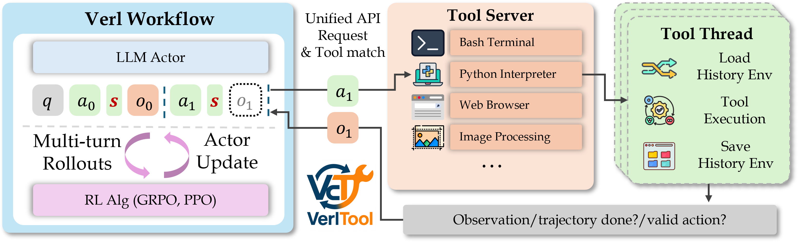

# MTA-Agent: An Open Recipe for Multimodal Deep Search Agents

<p align="center">
  
</p>

<h3 align="center">
Multi-modal Multi-hop Tool-Augmented Agent for Evidence-based QA Synthesis
</h3>

<p align="center">
  <a href="https://arxiv.org/abs/2604.06376">📄 Paper</a> •
  <a href="https://mta-agent.github.io/">🌐 Website</a> •
  <a href="https://github.com/SalesforceAIResearch/MTA-Agent">💻 Code</a> •
  <a href="https://huggingface.co/datasets/Salesforce/MTA-Vision-DeepSearch">🤗 Dataset</a>
</p>

<p align="center">
  <b>Xiangyu Peng*, Can Qin*, An Yan†, Xinyi Yang†, Zeyuan Chen, Ran Xu, Chien-Sheng Wu</b><br>
  Salesforce AI Research
</p>

---

## Abstract

Multimodal large language models (MLLMs) have demonstrated strong capabilities in visual understanding, yet they remain limited in complex, multi-step reasoning that requires deep searching and integrating visual evidence with external knowledge. In this work, we address this challenge by constructing high-quality, verified multi-hop vision-language training data for multimodal deep-search agents.

We propose **MTA-Agent** (Multi-hop Tool-Augmented Agent for Evidence-based QA Synthesis), which automatically selects tools and their parameters to retrieve and validate evidence from both visual and textual sources and generates structured multi-hop question-answer trajectories. Starting from diverse VQA seed datasets, our pipeline produces a large-scale training dataset, **MTA-Vision-DeepSearch**, containing **21K high-quality multi-hop examples**.

A 32B open-source multimodal search agent achieves **state-of-the-art performance**, reaching an average of **54.63%** across six challenging benchmarks, outperforming GPT-5 (51.86%), Gemini-2.5-Pro (50.98%), and Gemini-3-Pro (54.46%) under the same tool settings.

---

## Main Results

Accuracy (%) on six deep-search benchmarks. MTA-DeepSearch-32B achieves state-of-the-art, outperforming GPT-5 and Gemini models under the same tool settings.

| Model | MMSrch+ | HR-MMSrch | BC-VL | MMSrch | FVQA | MTA-test | Avg |
|---|---|---|---|---|---|---|---|
| **Agent Workflow (same tool setting)** | | | | | | | |
| GPT-5 | 31.61 | 52.13 | 51.63 | 77.65 | 72.28 | 25.84 | 51.86 |
| Gemini-2.5-Pro | 30.65 | 48.20 | 49.50 | 77.65 | 72.33 | 27.53 | 50.98 |
| Gemini-3-Pro | 33.51 | 53.20 | 51.78 | 82.94 | 76.67 | 28.65 | 54.46 |
| Qwen3-VL-32B-Inst. | 14.84 | 38.69 | 38.69 | 68.52 | 66.94 | 17.42 | 40.85 |
| **Our Models** | | | | | | | |
| MTA-DeepSearch-8B | 26.77 | 47.54 | 44.36 | 79.41 | 73.06 | 20.79 | 48.66 |
| **MTA-DeepSearch-32B** | **31.93** | **53.95** | **53.77** | **82.35** | **76.00** | **29.78** | **54.63** |

---

## Method Overview

### Tool-Augmented QA Agent
A ReAct-style agent with 4 tools (web search, web reader, Google Lens, image search) iteratively gathers evidence for multi-hop QA generation.

### Multi-Stage Verification
Generated QA pairs are verified for factual correctness, answer uniqueness, temporal stability, and entity dependency through independent checks.

### RL Training with DAPO
Models are fine-tuned using DAPO with cached tool interactions, enabling efficient training without real-time API calls.

---

## Key Findings

- **Deeper Search Behavior**: Training increases average search depth from **2.27 to 4.28 steps**, enabling more systematic and persistent multi-step retrieval strategies.
- **Structured Tool Usage**: After training, Web Search usage rises to **99%** and Reverse Image Search to **79%**, forming a consistent two-stage retrieval pipeline.
- **Cost-Efficient Replay Training**: Cached interaction replay enables effective RL training **without real-time tool calls**, significantly reducing training cost.

---

## Dataset

The **MTA-Vision-DeepSearch** training dataset is publicly available on HuggingFace:

📦 **[Salesforce/MTA-Vision-DeepSearch](https://huggingface.co/datasets/Salesforce/MTA-Vision-DeepSearch/tree/main)**

It contains 5 subsets (~3.5GB total):

| Subset | Description |
|---|---|
| `fvqa_qw3vl` | FVQA-based multi-hop QA |
| `infoseek_qw3vl` | InfoSeek-based multi-hop QA |
| `infovqa_qw3vl` | InfoVQA-based multi-hop QA |
| `okvqa_qw3vl` | OK-VQA-based multi-hop QA |
| `livevqa_news_qw3vl` | LiveVQA News-based multi-hop QA |

### Download

```python
from huggingface_hub import snapshot_download

snapshot_download(
    repo_id="Salesforce/MTA-Vision-DeepSearch",
    repo_type="dataset",
    local_dir="data/mm_deepsearch",
)
```

### Reproduce from Scratch

To regenerate the dataset from original VQA sources:

```bash
python examples/data_preprocess/mm_search/infovqa_qw3vl.py
python examples/data_preprocess/mm_search/infoseek_qw3vl.py
python examples/data_preprocess/mm_search/fvqa_qw3vl.py
python examples/data_preprocess/mm_search/okvqa_qw3vl.py
python examples/data_preprocess/mm_search/livevqa_news_qw3vl.py
```

---

## Setup

### Prerequisites

The following versions are required:
- vllm: 0.11.0
- verl: 0.7.0.dev0
- torch: 2.8.0
- transformers: 4.57.3
- qwen-omni-utils: 0.0.8
- qwen-vl-utils: 0.0.14
- ray: 2.52.1
- openai: 2.9.0
- flash-attn: 2.8.3

### Conda Installation (Recommended)

```bash
git submodule update --init --recursive
conda create --name verl-tool-env python=3.10
conda activate verl-tool-env
pip install -e verl
pip install -e ".[vllm,acecoder,torl,search_tool]"
pip install "flash-attn==2.8.3" --no-build-isolation
```

### Alternative: UV Installation

```bash
git submodule update --init --recursive
uv sync
source .venv/bin/activate
uv pip install -e verl
uv pip install -e ".[vllm,acecoder,torl,search_tool]"
uv pip install "flash-attn==2.8.3" --no-build-isolation
```

### Set API Keys

Create a `.env` file in the repo root (never commit this file):

```bash
TAVILY_API_KEY=your-tavily-key          # Web search
SERPAPI_API_KEY=your-serpapi-key        # Image search
SERPER_API_KEY=your-serper-key          # Google search
X_API_KEY=your-openai-gateway-key       # GPT-4 summarization (or use OPENAI_API_KEY)
```

---

## Training

### Setup WandB

```bash
export WANDB_API_KEY=<YOUR_WANDB_API_KEY>
export WANDB_ENTITY=<YOUR_WANDB_ENTITY>
```

### Launch Training

**8B Model (Qwen3-VL-8B, DAPO — recommended):**
```bash
conda activate verl-tool-env
bash examples/train/mm_deep_research/train/train_multimodal_8b_qwen3vl_dapo.sh
```

### Tool Server

Training automatically launches a multimodal tool server:

```bash
python -m verl_tool.servers.serve \
    --tool_type "web_text_to_text_search,web_text_to_img_search,web_url_reader,web_image_to_text,ocr_tool,ipython_code,bash_terminal" \
    --workers_per_tool 2 \
    --use_ray True
```

### Troubleshooting

- **OOM**: Reduce `gpu_memory_utilization` or enable `do_offload=True`
- **Tool server issues**: Check API keys and network connectivity
- **Training instability**: Reduce `lr` to `5e-7`, increase `lr_warmup_steps`
- **Debug mode**: `export VERL_DEBUG=1 NCCL_DEBUG=INFO VLLM_USE_V1=1`

---

## Features

- 🔧 **Complete decoupling of actor rollout and environment interaction** — Uses verl as a submodule. All tool calling is integrated via a unified API; add new tools by simply adding a Python file.
- 🌍 **Tool-as-environment paradigm** — Each tool interaction can modify the environment state. Environment states are stored and reloaded for each trajectory.
- ⚡ **Native RL framework for tool-calling agents** — Natively supports multi-turn interactive loops between agents and tool environments.
- 🖼️ **Multimodal support** — Native support for multimodal agent loops with image understanding, image search, and multimodal reasoning.
- 📊 **User-friendly evaluation suite** — Launch trained model with OpenAI API alongside the tool server; send questions and get final outputs with all interactions handled internally.



---

## 📚 Documentation

- 📖 [Installation Guide](./assets/docs/install.md)
- ⚡ [Synchronous Rollout Design](./assets/docs/sync_design.md)
- 🔄 [Asynchronous Rollout Design](./assets/docs/asyncRL.md)
- 🛠️ [Tool Server Design](./assets/docs/tool_server.md)
- 🎯 [Training Guide](./assets/docs/training_guide.md)
- 📊 [Evaluation Guide](./assets/docs/evaluation.md)
- 🔧 [Update Verl Submodule Version](./assets/docs/udpate_verl_version.md)

---

## Citation

```bibtex
@article{peng2026mtaagent,
  title     = {MTA-Agent: An Open Recipe for Multimodal Deep Search Agents},
  author    = {Peng, Xiangyu and Qin, Can and Yan, An and Yang, Xinyi and Chen, Zeyuan and Xu, Ran and Wu, Chien-Sheng},
  journal   = {arXiv preprint arXiv:2604.06376},
  year      = {2026}
}
```

---

## Contact

**Xiangyu Peng** — xiangyupeng1994@gmail.com

MTA-Agent © 2026 · Salesforce AI Research
